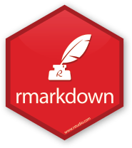
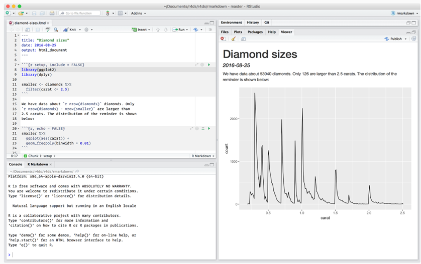
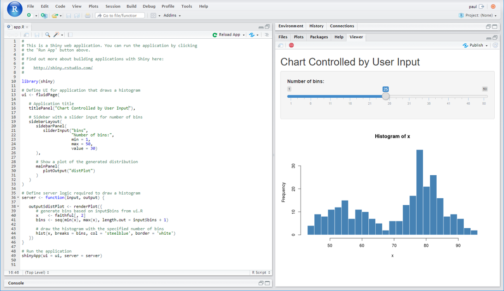

```{r communicate-setup, include=FALSE}
knitr::opts_chunk$set(
  message = FALSE,
  warning = FALSE,
  dev = "svg",
  cache = TRUE,
  cache.path = ".cache/",
  fig.path = "imgs/",
  fig.width = 11,
  fig.height = 5
)
options(htmltools.dir.version = FALSE)
```

# Communication

* All your coding is only going to be useful if you can effectively communicate the findings to a broader audience of stakeholders, in formats they are comfortable with.
* This is where R really excels above other programming languages:
* rmarkdown is an authoring format that enables the easy creation of dynamic documents, presentations, and reports from R. It combines the core syntax of markdown (an easy to write plain text format) with embedded R code chunks that are run so their output can be included in the final document
* Shiny makes it possible to build fully interactive web-apps and dashboards that puts the analytical and graphical power of R at the fingertips of your users in elegant, browser-based user interfaces




---

# Rmarkdown

* Combining narrative and commentary with code in a single document is a very powerful concept. It makes your report fully reproducible. That is, a script you can simply re-run whenever your data or code changes and all data-driven R outputs will update automatically in your report. No more copy & pasting data around various MS Office programs!*
* The output options enables you to share your analysis in the format your audience is most comfortable with, be it:
* HTML Report (enables the use of interactive graphics)
* HTML Slideshow (this entire slideshow is written in rmarkdown!)
* PDF Report
* MS Word Document
* MS PowerPoint Slides
* Dashboards
* Websites – rusergroup.co.za is written in rmarkdown
* Having your report as an executable R script also allows you to paramaterise some variables and automate the generation of several different reports - one for each subset of a data set, for example.
* Check out this video for a better illustration of the problem and solution to traditional data reporting methods. https://www.youtube.com/watch?v=s3JldKoA0zw

---

# Example of the code and output of an html rmarkdown report



---

# Shiny

* Shiny goes a step further and allows end-users to interact with a live R session through a user-interface, giving them the power of R without any required knowledge of coding.
* Shiny dashboards are significantly more powerful than expensive off-the-shelf dashboard software that are limited to visualising the data you supply to them with their own charting libraries. Shiny can draw on the vast eco-system of open-source technology, dynamically run any type of R code you want it to, and feed the results back to the end-user.
* Example Use Case
* fetch some live google analytics data
* merge it with some internal market research data
* run a model to calculate whether a recent marketing campaign drove a significant increase in web traffic
* visualise the results to the user in interactive charts
* give them the option of downloading an auto-generated rmarkdown PDF report
* And there's no limitations on the look and feel of your app. There's lots of great CSS themes to choose from, or if you know some HTML + CSS you can build a complety bespoke user interace interface from the ground-up.
* Check out some of the shiny apps we've made over on the Culture of Insight portfolio page.

---

